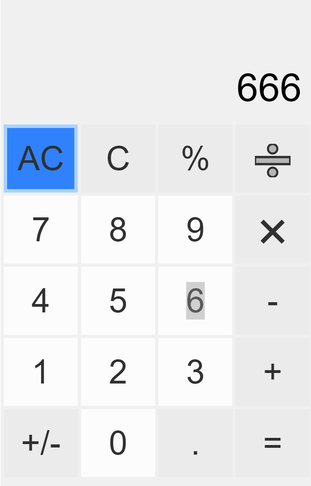
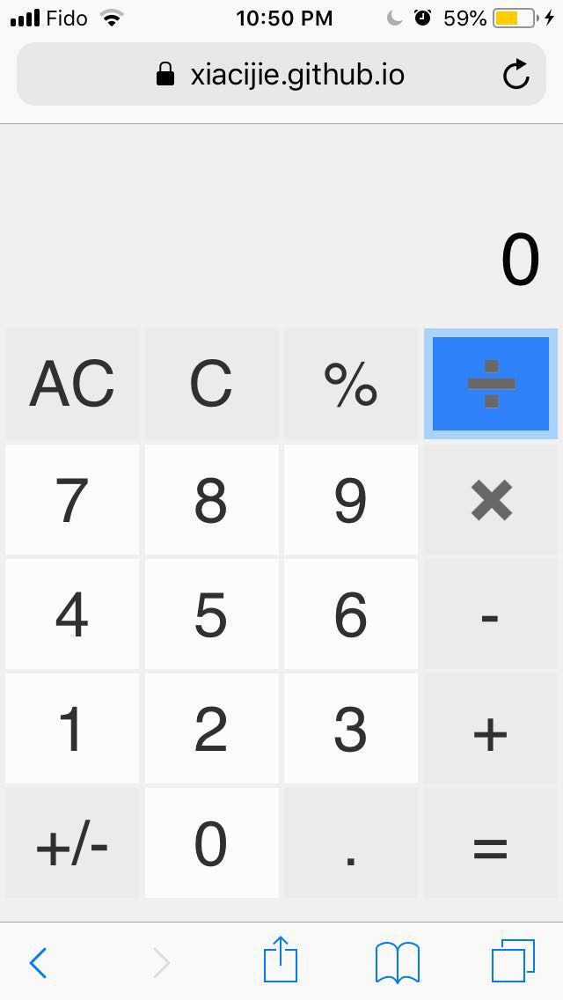

# react-calculator
An web calculator built by react.js and redux
---------------------------------------------

Requirements
------------
```
bash
node
npm
```

How to start
------------
1. Clone this project: `git clone https://github.com/xiacijie/react-calculator.git`
2. Enter the project: `cd react-calculator`
3. Install node modules: `npm install`
4. Start the application: `npm start`

Screenshots
-----------




